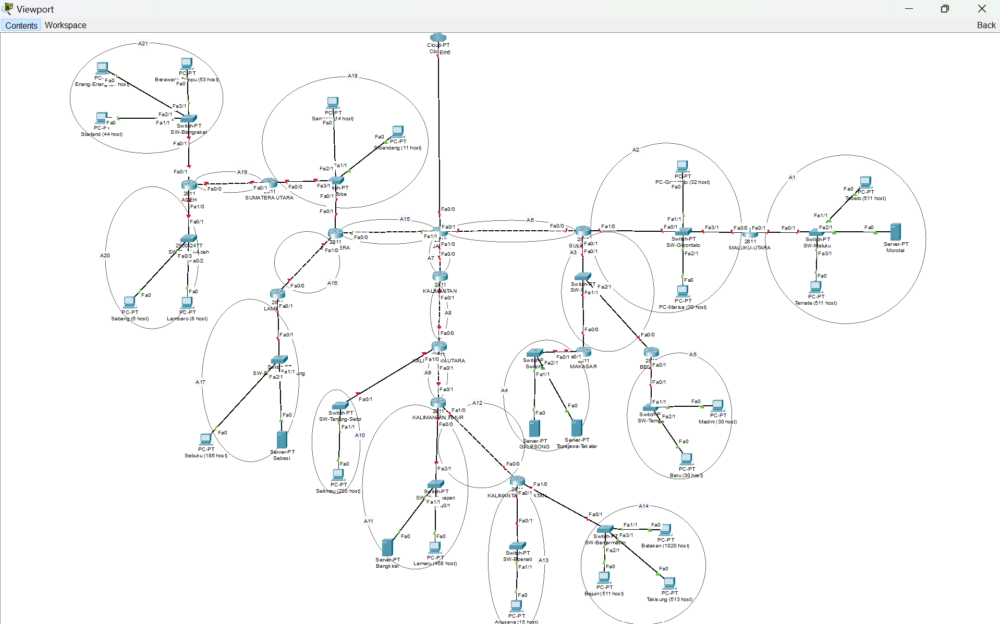
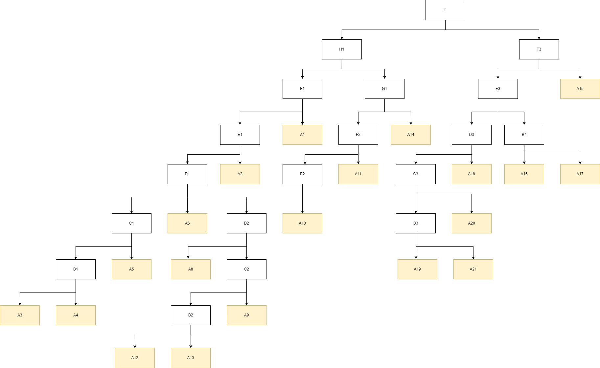

# Laporan Resmi

| Nama                                    | NRP        |
| --------------------------------------- | ---------- |
| Mohammad Arkananta Radithya Taratugang  | 5027221003 |
| Michael Wayne                           | 5027221037 |

## Daftar Isi

- [Laporan Resmi](#laporan-resmi)
- [Daftar Isi](#daftar-isi)
  - [Topologi CPT CIDR](#topologi-cpt-cidr)
  - [Topologi GNS3 VLSM](#topologi-gns-vlsm)
  - [Prefix IP](#prefix-ip)
  - [Rute](#rute)
- [VLSM](#vlsm)
- [CIDR](#cidr)
## Topologi CPT CIDR

## Topologi GNS VLSM

## Prefix IP

prefix IP `10.76`

## Rute

## VLSM

### Tree
Berikut merupakan hasil `pemecahan` subnet besar yang akan dibentuk menjadi `jaringan` yang lebih kecil

## CIDR

### Pembagian IP

Berikut merupakan hasil dari pembagian IP berdasarkan Tree yang telah dibuat pada GNS menggunakan CIRD

### Testing
