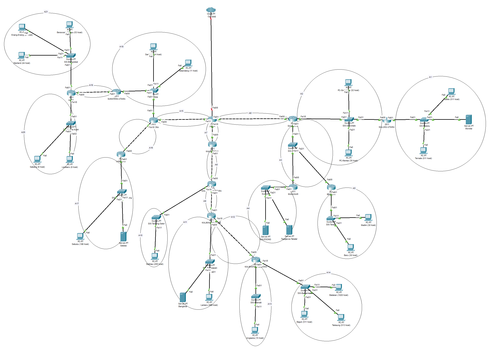
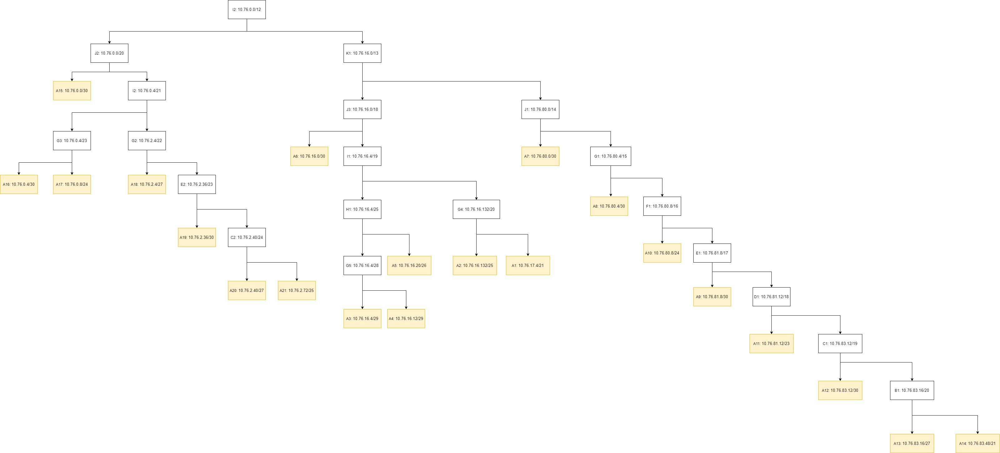

# Laporan Resmi

| Nama                                    | NRP        |
| --------------------------------------- | ---------- |
| Mohammad Arkananta Radithya Taratugang  | 5027221003 |
| Michael Wayne                           | 5027221037 |

## Daftar Isi

- [Laporan Resmi](#laporan-resmi)
- [Daftar Isi](#daftar-isi)
  - [Topologi CPT CIDR](#topologi-cpt-cidr)
  - [Topologi GNS3 VLSM](#topologi-gns-vlsm)
  - [Prefix IP](#prefix-ip)
  - [Rute](#rute)
- [VLSM](#vlsm)
- [CIDR](#cidr)
## Topologi CPT CIDR


## Topologi GNS VLSM


## Prefix IP

prefix IP `10.76`

## Rute


## VLSM

### Tree


### Network Config
- JAWA
```
auto lo
iface lo inet loopback

auto eth0
iface eth0 inet dhcp

#A15
auto eth1
iface eth1 inet static
address 10.76.21.197 
netmask 255.255.255.252

#A7
auto eth2
iface eth2 inet static
address 10.76.21.181
netmask 255.255.255.252

#A6
auto eth3
iface eth3 inet static
address 10.76.21.177
netmask 255.255.255.252
```
- SUMATERA
```
auto lo
iface lo inet loopback

#A15
auto eth0
iface eth0 inet static
address 10.76.21.198
netmask 255.255.255.252
gateway 10.76.21.197 

#A16
auto eth1
iface eth1 inet static
address 10.76.21.201
netmask 255.255.255.252

#A18
auto eth2
iface eth2 inet static
address 10.76.21.65 
netmask 255.255.255.224
```
- KALIMANTAN
```
#A7
auto eth0
iface eth0 inet static
address 10.76.21.182
netmask 255.255.255.252
gateway 10.76.21.181

#A8
auto eth1
iface eth1 inet static
address 10.76.21.185
netmask 255.255.255.252
```
- SULAWESI
```
#A6
auto eth0
iface eth0 inet static
address 10.76.21.178
netmask 255.255.255.252

#A3
auto eth1
iface eth1 inet static
address 10.76.21.161  
netmask 255.255.255.248

#A2
auto eth1
iface eth1 inet static
address 10.76.20.129 
netmask 255.255.255.128
```
- SUMATERA-UTARA
```
#A18
auto eth0
iface eth0 inet static
address 10.76.21.66
netmask 255.255.255.224
gateway 10.76.21.65 

#A19
auto eth1
iface eth1 inet static
address 10.76.21.205 
netmask 255.255.255.252
```
- ACEH
```
#A19
auto eth0
iface eth0 inet static
address 10.76.21.206
netmask 255.255.255.252
gateway 10.76.21.205 

#A21
auto eth1
iface eth1 inet static
address 10.76.20.1 
netmask 255.255.255.128

#A20
auto eth1
iface eth1 inet static
address 10.76.21.129 
netmask 255.255.255.224
```
- LAMPUNG
```
#A16
auto eth0
iface eth0 inet static
address 10.76.21.202
netmask 255.255.255.252
gateway 10.76.21.201

#A17
auto eth1
iface eth1 inet static
address 10.76.19.1 
netmask 255.255.255.224
```
- Berawang-Tampu
```
#A21
auto eth0
iface eth0 inet static
address 10.76.20.2
netmask 255.255.255.128
gateway 10.76.20.1 
```

- Enang-Enang
```
#A21
auto eth0
iface eth0 inet static
address 10.76.20.3
netmask 255.255.255.128
gateway 10.76.20.1 
```

- Starland
```
#A21
auto eth0
iface eth0 inet static
address 10.76.20.4
netmask 255.255.255.128
gateway 10.76.20.1 
```

- Sabang
```
#A20
auto eth0
iface eth0 inet static
address 10.76.21.130
netmask 255.255.255.224
gateway 10.76.21.129 
```

- Lambaro
```
#A20
auto eth0
iface eth0 inet static
address 10.76.21.131
netmask 255.255.255.224
gateway 10.76.21.129 
```

- Sebuku
```
#A17
auto eth0
iface eth0 inet static
address 10.76.19.3
netmask 255.255.255.0
gateway 10.76.19.1 
```

- Sebesi
```
#A17
auto eth0
iface eth0 inet static
address 10.76.19.2
netmask 255.255.255.0
gateway 10.76.19.1 
```

- Samosir
```
#A18
auto eth0
iface eth0 inet static
address 10.76.21.67
netmask 255.255.255.224
gateway 10.76.21.65 
```

- Sibandang
```
#A18
auto eth0
iface eth0 inet static
address 10.76.21.68
netmask 255.255.255.224
gateway 10.76.21.65 
```

- Starland
```
#A21
auto eth0
iface eth0 inet static
address 10.76.20.4
netmask 255.255.255.128
gateway 10.76.20.1 
```

- KALIMANTAN-UTARA
```
#A8
auto eth0
iface eth0 inet static
address 10.76.21.186
netmask 255.255.255.252
gateway 10.76.21.185

#A9
auto eth1
iface eth1 inet static
address 10.76.21.189
netmask 255.255.255.252
```

- KALIMANTAN-TIMUR
```
#A9
auto eth0
iface eth0 inet static
address 10.76.21.190
netmask 255.255.255.252
gateway 10.76.21.189

#A12
auto eth1
iface eth1 inet static
address 10.76.21.193
netmask 255.255.255.252

#A11
auto eth2
iface eth2 inet static
address 10.76.16.1
netmask 255.255.254.0
```

- KALIMANTAN-SELATAN
```
#A12
auto eth0
iface eth0 inet static
address 10.76.21.194
netmask 255.255.255.252
gateway 10.76.21.193

#A13
auto eth1
iface eth1 inet static
address 10.76.21.97 
netmask 255.255.255.224
```

- Batakan
```
#A14
auto eth0
iface eth0 inet static
address 10.76.0.4
netmask 255.255.248.0
gateway 10.76.0.1 
```

- Bajuing
```
#A14
auto eth0
iface eth0 inet static
address 10.76.0.2
netmask 255.255.248.0
gateway 10.76.0.1 
```

- Takisung
```
#A14
auto eth0
iface eth0 inet static
address 10.76.0.3
netmask 255.255.248.0
gateway 10.76.0.1 
```

- Angsana
```
#A13
auto eth0
iface eth0 inet static
address 10.76.21.98
netmask 255.255.255.224
gateway 10.76.21.97 
```

- Bangkirai
```
#A11
auto eth0
iface eth0 inet static
address 10.76.16.2
netmask 255.255.254.0
gateway 10.76.16.1
```

- Lamaru
```
#A11
auto eth0
iface eth0 inet static
address 10.76.16.3
netmask 255.255.254.0
gateway 10.76.16.1
```

- Selimau
```
#A10
auto eth0
iface eth0 inet static
address 10.76.18.2
netmask 255.255.255.0
gateway 10.76.18.1 
```

- MAKASAR
```
#A10
auto eth0
iface eth0 inet static
address 10.76.18.2
netmask 255.255.255.0
gateway 10.76.18.1 
```

- BELAWA
```
#A10
auto eth0
iface eth0 inet static
address 10.76.18.2
netmask 255.255.255.0
gateway 10.76.18.1 
```

- MALUKU-UTARA
```
#A10
auto eth0
iface eth0 inet static
address 10.76.18.2
netmask 255.255.255.0
gateway 10.76.18.1 
```

- Galesong
```
#A4
auto eth0
iface eth0 inet static
address 10.76.21.170
netmask 255.255.255.248
gateway 10.76.21.169 
```

- Topejawa-Takalar
```
#A4
auto eth0
iface eth0 inet static
address 10.76.21.171
netmask 255.255.255.248
gateway 10.76.21.169 
```

- Madini
```
#A5
auto eth0
iface eth0 inet static
address 10.76.21.2
netmask 255.255.255.192
gateway 10.76.21.1 
```

- Banu
```
#A5
auto eth0
iface eth0 inet static
address 10.76.21.3
netmask 255.255.255.192
gateway 10.76.21.1 
```

- Gorontalo
```
#A2
auto eth0
iface eth0 inet static
address 10.76.20.131
netmask 255.255.255.128
gateway 10.76.20.129 
```

- Marisa
```
#A2
auto eth0
iface eth0 inet static
address 10.76.20.132
netmask 255.255.255.128
gateway 10.76.20.129 
```

- Ternate
```
#A1
auto eth0
iface eth0 inet static
address 10.76.8.3
netmask 255.255.248.0
gateway 10.76.8.1 
```

- Morotai
```
#A1
auto eth0
iface eth0 inet static
address 10.76.8.2
netmask 255.255.248.0
gateway 10.76.8.1 
```

- Tobelo
```
#A1
auto eth0
iface eth0 inet static
address 10.76.8.4
netmask 255.255.248.0
gateway 10.76.8.1 
```

### Routing
- MALUKU-UTARA
```
route add -net 0.0.0.0 netmask 0.0.0.0 gw 10.76.20.129 
```
- MAKASAR
```
route add -net 0.0.0.0 netmask 0.0.0.0 gw 10.76.21.161  
```
- BELAWA
```
route add -net 0.0.0.0 netmask 0.0.0.0 gw 10.76.21.161
```
- SULAWESI
```
#A1
route add -net 10.76.8.0 netmask 255.255.248.0 gw 10.76.20.130
#A4
route add -net 10.76.21.168 netmask 255.255.255.248 gw 10.76.21.163
#A5
route add -net 10.76.21.0 netmask 255.255.255.192 gw 10.76.21.162 
```
- KALIMANTAN-SELATAN
```
route add -net 0.0.0.0 netmask 0.0.0.0 gw 10.76.21.193  
```
- KALIMANTAN-TIMUR
```
#A13
route add -net 10.76.21.96 netmask 255.255.255.224 gw 10.76.21.194
#A14
route add -net 10.76.0.0  netmask 255.255.248.0 gw 10.76.21.194
```
- KALIMANTAN-UTARA
```
#A11
route add -net 10.76.16.0 netmask 255.255.254.0 gw 10.76.21.190
#A12
route add -net 10.76.21.192 netmask 255.255.255.252 gw 10.76.21.190
#A13
route add -net 10.76.21.96 netmask 255.255.255.224 gw 10.76.21.190
#A14
route add -net 10.76.0.0  netmask 255.255.248.0 gw 10.76.21.190
```
- KALIMANTAN
```
#A9
route add -net 10.76.21.188 netmask 255.255.255.252 gw 10.76.21.186
#A10
route add -net 10.76.18.0 netmask 255.255.255.0 gw 10.76.21.186
#A11
route add -net 10.76.16.0 netmask 255.255.254.0 gw 10.76.21.186
#A12
route add -net 10.76.21.192 netmask 255.255.255.252 gw 10.76.21.186
#A13
route add -net 10.76.21.96 netmask 255.255.255.224 gw 10.76.21.186
#A14
route add -net 10.76.0.0  netmask 255.255.248.0 gw 10.76.21.186
```
- ACEH
```
route add -net 0.0.0.0 netmask 0.0.0.0 gw 10.76.21.205  
```
- LAMPUNG
```
route add -net 0.0.0.0 netmask 0.0.0.0 gw 10.76.21.65 
```
- SUMATERA-UTARA
```
#A21
route add -net 10.76.20.0 netmask 255.255.255.128 gw 10.76.21.206
#A20
route add -net 10.76.21.128 netmask 255.255.255.224 gw 10.76.21.206
```
- SUMATERA
```
#A21
route add -net 10.76.20.0 netmask 255.255.255.128 gw 10.76.21.66
#A20
route add -net 10.76.21.128 netmask 255.255.255.224 gw 10.76.21.66
#A19
route add -net 10.76.21.204 netmask 255.255.255.252 gw 10.76.21.66
#A16
route add -net 10.76.19.0 netmask 255.255.255.0 gw 10.76.21.202
```
- JAWA
```
##SUMATERA
route add -net 10.76.20.0 netmask 255.255.255.128 gw 10.76.21.198
route add -net 10.76.21.128 netmask 255.255.255.224 gw 10.76.21.198
route add -net 10.76.21.204 netmask 255.255.255.252 gw 10.76.21.198
route add -net 10.76.19.0 netmask 255.255.255.0 gw 10.76.21.198
route add -net 10.76.21.200 netmask 255.255.255.252 gw 10.76.21.198
route add -net 10.76.21.64 netmask 255.255.255.224 gw 10.76.21.198

##KALIMANTAN
route add -net 10.76.21.184 netmask 255.255.255.252 gw 10.76.21.182
route add -net 10.76.21.188 netmask 255.255.255.252 gw 10.76.21.182
route add -net 10.76.18.0 netmask 255.255.255.0 gw 10.76.21.182
route add -net 10.76.16.0 netmask 255.255.254.0 gw 10.76.21.182
route add -net 10.76.21.192 netmask 255.255.255.252 gw 10.76.21.182
route add -net 10.76.21.96 netmask 255.255.255.224 gw 10.76.21.182
route add -net 10.76.0.0  netmask 255.255.248.0 gw 10.76.21.182

##SULAWESI
#A1
route add -net 10.76.8.0 netmask 255.255.248.0 gw 10.76.21.178
#A2
route add -net 10.76.20.128 netmask 255.255.255.128 gw 10.76.21.178
#A3
route add -net 10.76.21.168 netmask 255.255.255.248 gw 10.76.21.178
#A4
route add -net 10.76.21.168 netmask 255.255.255.248 gw 10.76.21.178
#A5
route add -net 10.76.21.0 netmask 255.255.255.192 gw 10.76.21.178
```

## CIDR


### Penggabungan IP

Berikut merupakan hasil dari penggabungan IP berdasarkan Tree yang telah dibuat pada CPT menggunakan CIDR


### Pembagian IP

Berikut merupakan hasil dari pembagian IP berdasarkan Tree yang telah dibuat pada CPT menggunakan CIDR


### Testing
## CIDR


## VLSM
